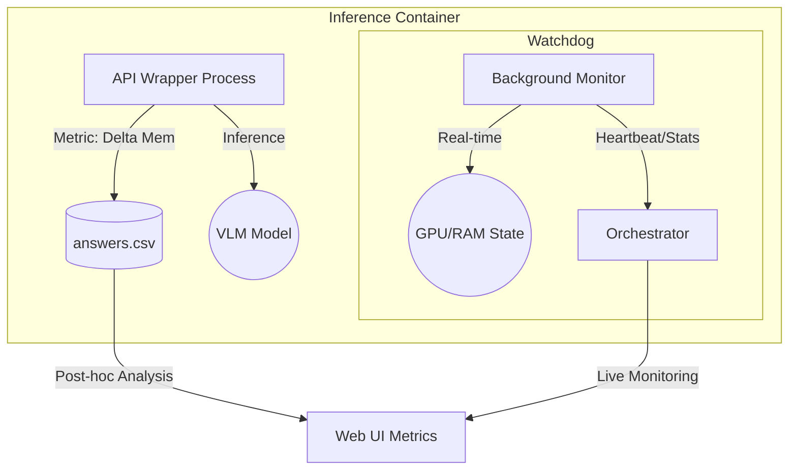

# ADR-010: Мониторинг ресурсов и отслеживание прогресса

## Статус
Предложено (Proposed)

## Контекст
Для оценки VLM важно понимать не только точность ответов, но и эффективность использования ресурсов (GPU, RAM). Кроме того, при длительных бенчмарках необходим живой мониторинг состояния системы для предотвращения зависаний (например, из-за OOM) и визуализации прогресса.

## Решение
Мы внедряем двухуровневую систему мониторинга и событийно-ориентированное отслеживание прогресса.

### 1. Уровни мониторинга ресурсов

#### Уровень 1: Метрики эффективности (ML Metrics)
- **Цель**: Сбор данных для сравнения моделей по ресурсоемкости.
- **Реализация**: `APIWrapper` замеряет использование видеопамяти и время до (start) и после (end) каждого запроса.
- **Данные**: Пиковая дельта VRAM, TTFT, TPOT. Эти данные сохраняются в `answers.csv` и отображаются в итоговых отчетах как характеристики модели.

#### Уровень 2: Системный мониторинг (Watchdog)
- **Цель**: Живой мониторинг состояния контейнера и диагностика сбоев.
- **Реализация**: В контейнере модели запускается независимый фоновый процесс (Watchdog), который с высокой частотой опрашивает состояние GPU/RAM (через `nvidia-smi` или `pynvml`).
- **Синхронизация**: Watchdog может отправлять "heartbeat" и текущую статистику Оркестратору. Если `APIWrapper` зависает из-за нехватки памяти, Watchdog позволит зафиксировать это состояние до падения контейнера.

### 2. Визуализация архитектуры мониторинга

### 3. Отслеживание прогресса (Event-Driven)
Мы переходим от модели опроса (polling) к модели push-уведомлений:
1.  **API Wrapper** при завершении обработки каждого объекта датасета отправляет асинхронный сигнал Оркестратору (`POST /events`).
2.  **Orchestrator** обновляет глобальный счетчик прогресса в `TaskTracker`.
3.  **Backend** транслирует обновление в **Web UI** через WebSockets.
4.  Это обеспечивает "мгновенную" синхронизацию состояния прогресса на дашборде.

## Последствия

### Плюсы
- **Прозрачность**: Возможность выбора модели на основе баланса Accuracy/Efficiency.
- **Надежность**: Быстрое обнаружение зависаний инференса через Watchdog.
- **UX**: Плавное обновление прогресс-баров и живых графиков в интерфейсе.

### Минусы
- Дополнительная нагрузка на CPU/GPU от фонового процесса Watchdog (минимальна при правильной настройке частоты опроса).
- Усложнение сетевого взаимодействия между контейнером и Оркестратором.