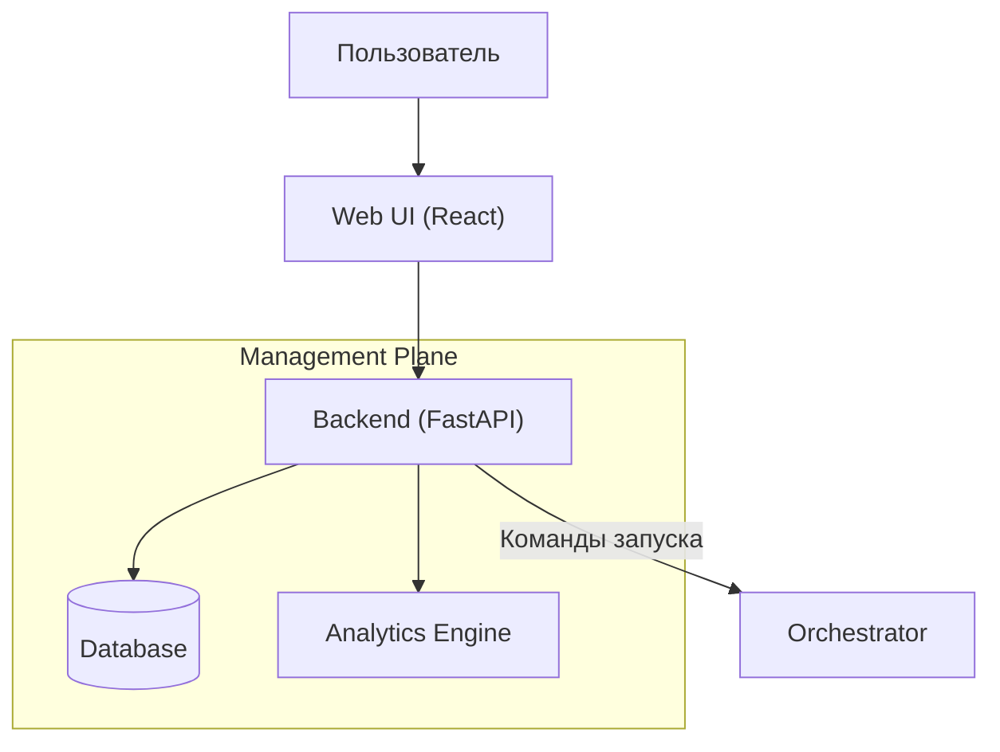
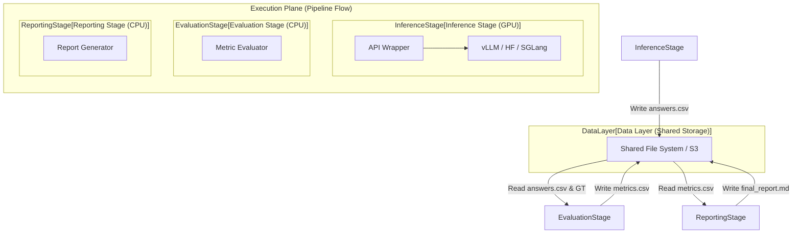
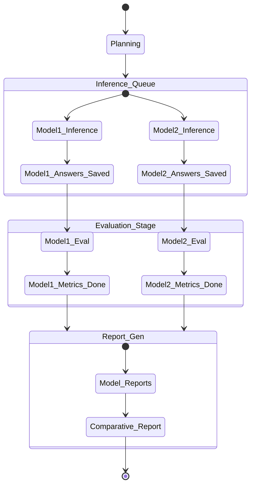

# Архитектурная концепция

VLMHyperBench — это модульный, расширяемый фреймворк для оценки Vision Language Models (VLM), построенный на принципах **микросервисной архитектуры** и **строгой изоляции окружений**.

## 1. Философия

1.  **Изоляция превыше всего**: Мы не пытаемся установить все библиотеки в один Python environment. Каждая модель и каждый этап оценки запускаются в собственном изолированном контейнере.
2.  **Everything is a Registry**: Модели, Задачи, Метрики — это подключаемые модули (плагины), регистрируемые в системе. Ядро фреймворка агностично к конкретным реализациям.
3.  **Configuration as Code**: Весь эксперимент описывается декларативными конфигурационными файлами (CSV/JSON).
4.  **Environment Agnostic**: Код этапа не знает, где он выполняется (локальный Docker, Run Pod или HPC Singularity).

## 2. Компонентная модель (v0.2.0)

Система разделена на три основные плоскости: **Management Plane**, **Execution Plane** и **Inference Layer**.

### 2.1. Слой управления (Management Plane)

Обеспечивает интерфейс взаимодействия с пользователем и хранение истории экспериментов.

#### 2.1.1. Оркестратор
*   **Responsibility**: Чтение конфига, планирование очереди задач, запуск контейнеров, обработка ошибок.
*   **Logic**:
    1.  Парсинг `user_config.csv` и сопоставление с реестрами.
    2.  Планирование задач (Scheduling) с поддержкой асинхронного запуска и распараллеливания по GPU.
    3.  **Event-Driven Tracking**: Прием сигналов прогресса от контейнеров и трансляция в Web UI.
    4.  Подготовка томов (Volumes).
    5.  Последовательный запуск этапов (Inference -> Eval -> Report) с поддержкой инкрементальных прогонов.

### 2.2. Слой исполнения (Execution Plane)

Изолированные окружения, в которых выполняются конкретные этапы бенчмарка. Все этапы взаимодействуют через общую файловую систему.

### 2.3. Жизненный цикл бенчмарка (State Machine)

## 3. Ключевые принципы реализации

### 3.1. Абстракция окружений
Система не привязана к конкретной среде исполнения. Через интерфейс `EnvManager` поддерживаются Docker, Singularity и облачные провайдеры (RunPod).

### 3.2. Стандартизация инференса
Использование **API Wrapper** позволяет ядру системы взаимодействовать с любой моделью через единый OpenAI-совместимый протокол, независимо от используемого бэкенда (vLLM, HF, SGLang).

### 3.3. Плагинная архитектура
Расширение возможностей (новые модели, задачи, метрики) происходит путем добавления новых пакетов, реализующих стандартные интерфейсы, без модификации кода ядра.

### 3.4. Динамические зависимости
Минимизация количества Docker-образов за счет установки специфичных библиотек "на лету" при старте контейнера.

## 4. Поток данных (Workflow)

1.  **Initialization**: Оркестратор парсит конфиг, подготавливает план запуска.
2.  **Environment Setup**: `EnvManager` поднимает контейнер. Выполняется **Dynamic Dependency Injection** (установка драйверов модели и библиотек метрик).
3.  **Data Sync**: Если требуется, данные скачиваются из S3 на локальный диск (Smart Sync).
4.  **Inference & Live Monitoring**: Запуск модели. `APIWrapper` асинхронно сообщает о прогрессе и потреблении ресурсов. Генерация ответов -> `answers.csv`.
5.  **Evaluation**: Запуск легкого контейнера оценки. Валидация структуры (Pydantic), расчет текстовых и ресурсных метрик -> `metrics.csv`.
6.  **Reporting**: Агрегация результатов и генерация отчета -> `report.md`.

## 5. Технологический стек
*   **Core**: Python 3.10+, Pydantic.
*   **Containerization**: Docker SDK.
*   **Inference Backends**: vLLM, Transformers, SGLang.
*   **Data**: Pandas, Polars.