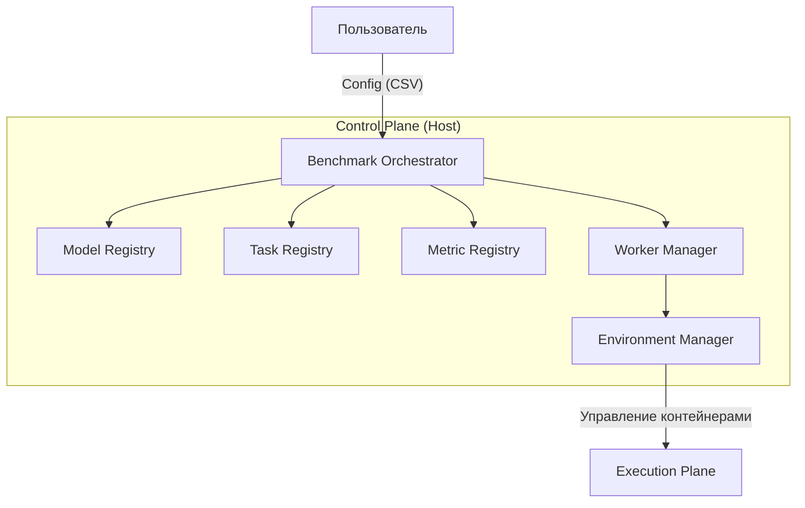
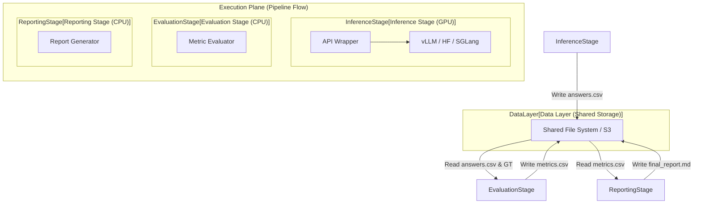
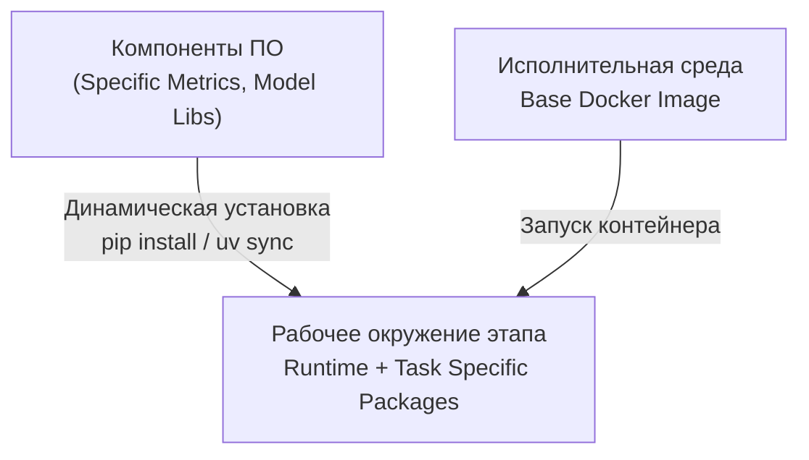

# Архитектурная концепция

VLMHyperBench — это модульный, расширяемый фреймворк для оценки Vision Language Models (VLM), построенный на принципах **микросервисной архитектуры** и **строгой изоляции окружений**.

## 1. Философия

1.  **Изоляция превыше всего**: Мы не пытаемся установить все библиотеки в один Python environment. Каждая модель и каждый этап оценки запускаются в собственном изолированном контейнере.
2.  **Everything is a Registry**: Модели, Задачи, Метрики — это подключаемые модули (плагины), регистрируемые в системе. Ядро фреймворка агностично к конкретным реализациям.
3.  **Configuration as Code**: Весь эксперимент описывается декларативными конфигурационными файлами (CSV/JSON).
4.  **Environment Agnostic**: Код этапа не знает, где он выполняется (локальный Docker, Kubernetes Pod или HPC Singularity).

## 2. Компонентная модель

Система разделена на две основные плоскости: **Control Plane** (управление) и **Execution Plane** (исполнение).

### 2.1. Управляющий слой (Control Plane)

Отвечает за логику планирования, управление ресурсами и реестры компонентов.

#### 2.1.1. Оркестратор
*   **Responsibility**: Чтение конфига, планирование очереди задач, запуск контейнеров, обработка ошибок.
*   **Logic**:
    1.  Парсинг `user_config.csv` и сопоставление с реестрами.
    2.  Планирование задач (Scheduling) с поддержкой асинхронного запуска и распараллеливания по GPU.
    3.  Подготовка томов (Volumes).
    4.  Последовательный запуск этапов (Inference -> Eval -> Report).

### 2.2. Слой исполнения (Execution Plane)

Изолированные окружения, в которых выполняются конкретные этапы бенчмарка. Все этапы взаимодействуют через общую файловую систему.

## 3. Ключевые компоненты

### 3.1. Benchmark Orchestrator
Центральный управляющий элемент. Читает пользовательский конфиг, разрешает зависимости через реестры и планирует задачи.

### 3.2. Environment Manager (`EnvManager`)
Абстракция для управления изолированными средами. Поддерживает различные бэкенды:
*   **DockerEnvManager**: Для локального запуска в Docker.
*   **RunPodEnvManager**: Для запуска в облаке RunPod.
*   **SingularityEnvManager**: Для запуска на HPC кластерах.
*   **VenvManager**: Для локального запуска в виртуальном окружении.

### 3.3. Inference Stage & API Wrapper
Для унификации работы с разными бэкендами (HuggingFace, vLLM, SGLang) используется **API Wrapper**, который запускается внутри контейнера модели и предоставляет единый API (`/v1/chat/completions`).

### 3.4. Registries & Plugins
Система расширяется через Python-пакеты, реализующие стандартные интерфейсы:
*   `Task`: Формат данных и стратегию промптинга.
*   `ModelInterface`: Адаптер для загрузки и инференса модели.
*   `Metric`: Логика сравнения предсказания с эталоном.

### 3.5. Динамическое управление зависимостями
Для обеспечения гибкости и минимизации количества пересборок Docker-образов, применяется принцип **динамической установки компонентов**.
Каждый этап (Stage) может требовать свой уникальный набор пакетов, который устанавливается в контейнер при запуске.

## 4. Поток данных (Workflow)

1.  **Initialization**: Оркестратор парсит конфиг, подготавливает план запуска.
2.  **Environment Setup**: `EnvManager` поднимает контейнер. Выполняется **Dynamic Dependency Injection** (установка драйверов модели и библиотек метрик).
3.  **Inference**: Запуск модели, генерация ответов -> `answers.csv`.
4.  **Evaluation**: Запуск легкого контейнера оценки. Расчет метрик -> `metrics.csv`.
5.  **Reporting**: Агрегация результатов и генерация отчета -> `report.md`.