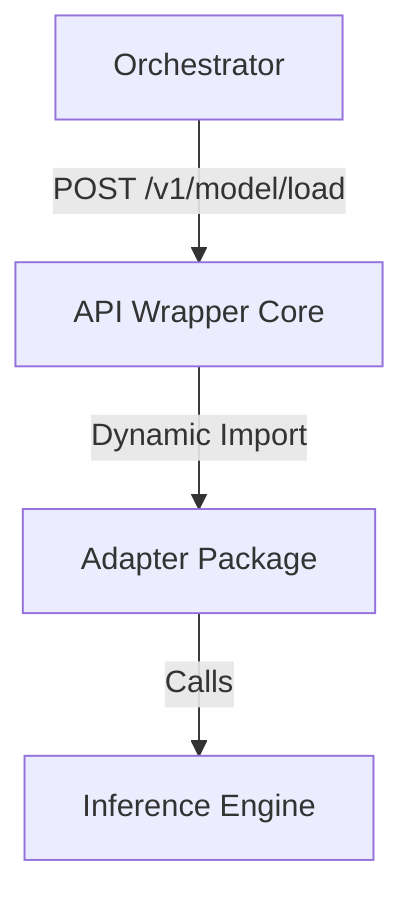

# Модульность слоя инференса

В версии v0.2.0 слой инференса был полностью переработан для обеспечения максимальной гибкости и изоляции зависимостей.

## Архитектурный подход: Viral Modularity

Мы отказались от монолитного API Wrapper в пользу разделения на легковесное ядро и динамически загружаемые адаптеры. Это позволяет:
1.  **Минимизировать размер базовых образов**: Ядро не содержит тяжелых зависимостей (vLLM, PyTorch).
2.  **Изолировать конфликты**: Адаптеры разных фреймворков (vLLM vs SGLang) живут в разных пакетах и не конфликтуют по версиям библиотек.
3.  **Ускорить разработку**: Новые адаптеры добавляются как независимые Python-пакеты без изменения кода ядра.

## Компоненты системы

### 1. API Wrapper Core (`packages/api_wrapper`)
Центральный прокси-сервер, отвечающий за:
*   **Control Plane**: Эндпоинты `/v1/model/load` и `/v1/model/unload`.
*   **Data Plane**: OpenAI-совместимый интерфейс `/v1/chat/completions`.
*   **Телеметрия**: Сбор метрик (Latency, VRAM, CPU) через встроенный Watchdog.

### 2. Адаптеры (Adapters)
Специализированные пакеты, реализующие интерфейс `AbstractBackend`:
*   `vllm-adapter`: Базовая реализация для `vllm.AsyncLLMEngine`.
*   `deepseek-adapter`: Расширение vLLM для  модели **DeepSeek-OCR**.

## Логика выбора адаптера (Smart Discovery)

Оркестратор автоматически определяет нужный пакет адаптера на основе реестра моделей.

1.  **Реестр моделей**: Каждая модель жестко привязана к `framework` и `backend_class`.
2.  **JIT установка**: Перед запуском Оркестратор устанавливает ядро и нужный пакет адаптера в контейнер.
3.  **Динамическая загрузка**: Ядро загружает класс адаптера через `importlib` во время вызова `/v1/model/load`.

## Источники и лучшие практики

При проектировании модульности использовались подходы ведущих платформ инференса:
*   **KServe Control Plane**: [Модель разделения Data и Control Plane](https://kserve.github.io/website/latest/modelserving/control_plane/).
*   **NVIDIA Triton Model Management**: [Динамическая загрузка и выгрузка моделей](https://docs.nvidia.com/deeplearning/triton-inference-server/user-guide/docs/user_guide/model_management.html).
*   **BentoML Architecture**: [Принципы изоляции рантаймов](https://docs.bentoml.org/en/latest/guides/model_management.html).