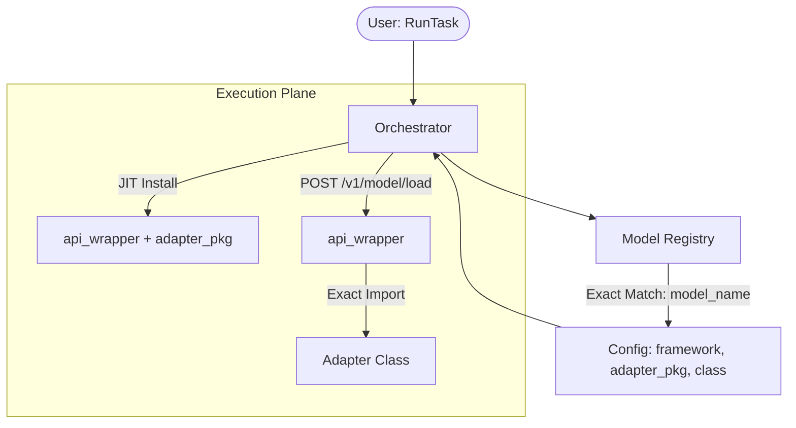

# Реестры и распределение ответственности

Архитектура v0.2.0 четко разделяет "Что делать" и "Как делать" через систему YAML-реестров.

## Распределение ответственности

| Сущность | Реестр | Ответственность |
| :--- | :--- | :--- |
| **MLTask** | `registries/tasks/` | Описание задачи (VQA, OCR), список метрик и отчетов. Не зависит от фреймворка. Содержит `supported_frameworks`. |
| **Framework** | `registries/frameworks/` | Описание движка (vLLM, SGLang), маппинг моделей на пакеты-адаптеры. |
| **Package** | `registries/packages/` | Ссылка на исходный код (Git/Local/PyPI) для JIT-установки. |
| **RunTask** | `registries/runs/` | Конкретный запуск: модель, датасет, параметры железа (`engine_params`) и секреты (`env`). |

## Схема интеграции (Smart Discovery)

1.  **RunTask** указывает на модель.
2.  Оркестратор ищет модель в **Model Registry** (vlm_base.yaml).
3.  Из реестра извлекается `framework` и `backend_class`.
4.  Оркестратор сверяет `framework` с `MLTask.supported_frameworks`.
5.  Оркестратор находит пакет адаптера в **Package Registry** и выполняет установку.

Этот подход позволяет менять движки инференса, не изменяя описание самой научной задачи (MLTask).

## Источники и лучшие практики
Архитектура реестров вдохновлена промышленными системами управления моделями:
*   **MLServer (Seldon)**: [Декларативное описание реализации моделей](https://medium.com/@senthilrch/ml-inference-servers-explained-f8fb24e3ebe5).
*   **Kubernetes Custom Resources (CRD)**: [Принципы разделения спецификаций задач и рантаймов](https://kserve.github.io/website/docs/reference/crd-api).