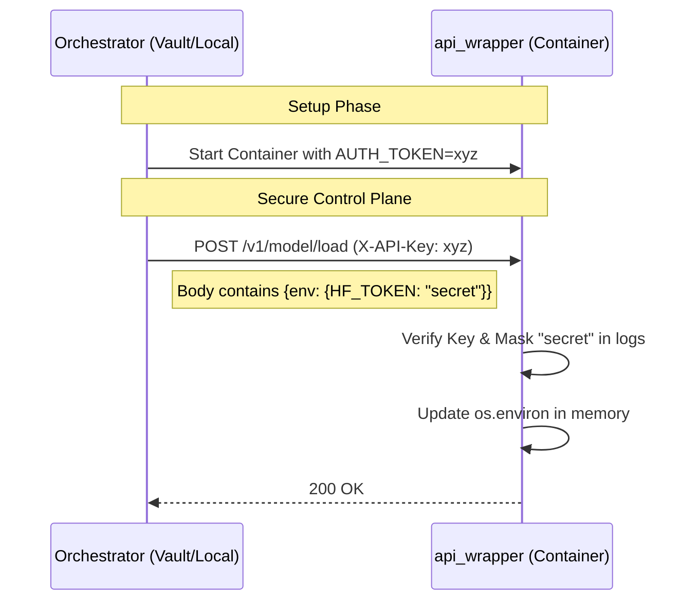

# Безопасность и передача секретов

Слой инференса v0.2.0 спроектирован с учетом требований безопасности при работе в распределенных GPU-кластерах.

## Многоуровневая защита (Defense in Depth)

### 1. Авторизация (Internal API Key)
Все запросы к API Wrapper (как Control Plane, так и Data Plane) должны содержать заголовок `X-API-Key`.
*   Токен генерируется Оркестратором при старте контейнера.
*   Передается серверу через переменную окружения `AUTH_TOKEN`.

### 2. Безопасная передача секретов
Для работы с Hugging Face или приватными S3-хранилищами часто требуются токены. Мы не передаем их через параметры запуска Docker (чтобы избежать утечки через `docker inspect`).

**Механизм инъекции**:
1.  Оркестратор отправляет секреты в теле POST-запроса на `/v1/model/load` в поле `env`.
2.  API Wrapper обновляет `os.environ` в памяти процесса.
3.  Секреты доступны библиотекам инференса, но не видны в системных процессах.

### 3. Маскировка в логах (Secrets Masking)
API Wrapper автоматически маскирует любые значения, переданные в поле `env`. В логах сервера вы увидите:
`INFO:api_wrapper: Set environment variable: HF_TOKEN=********`

### 4. Изоляция сети
Рекомендуется запускать контейнеры инференса в изолированных Docker-сетях или VPC, где доступ к порту 8000 имеет только Оркестратор.

## Схема защищенного взаимодействия

## Шифрование трафика
При работе с удаленными серверами инференса необходимо использовать HTTPS. `api_wrapper` поддерживает запуск через `uvicorn` с указанием SSL-сертификатов.

## Источники и лучшие практики
Система безопасности спроектирована на основе стандартов облачных провайдеров:
*   **Databricks Model Serving**: [Управление секретами через переменные окружения](https://docs.databricks.com/gcp/en/machine-learning/model-serving/store-env-variable-model-serving).
*   **Amazon SageMaker**: [Защита данных в транзите и mTLS](https://docs.aws.amazon.com/sagemaker/latest/dg/encryption-in-transit.html).
*   **Google Cloud Vertex AI**: [Изоляция сетей и VPC для инференса](https://cloud.google.com/architecture/ml-on-gcp-best-practices#network-isolation).