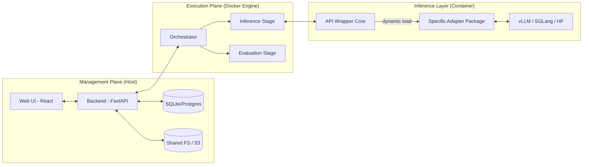
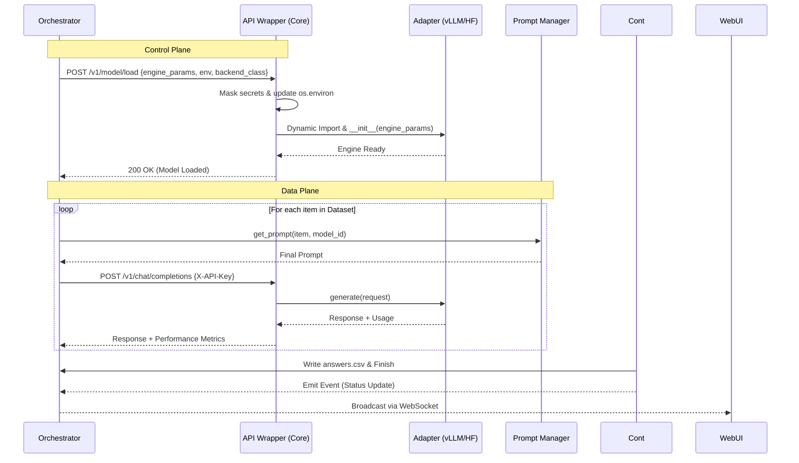

# Детальная спецификация архитектуры VLMHyperBench v0.2.0

Этот документ содержит детальное описание архитектуры платформы VLMHyperBench версии 0.2.0, включая описание модулей, классов, методов и схему их взаимодействия.

## 1. Общая схема платформы

Платформа разделена на три функциональные плоскости: **Management**, **Execution** и **Inference**.



### 1.2. Взаимодействие компонентов (Sequence Diagram)



## 2. Подсистема управления (Management Plane)

### 2.1. Backend (FastAPI)
*   **Role**: Центральный узел управления состоянием и данными.
*   **Key Methods**:
    *   `POST /experiments`: Создание нового бенчмарка.
    *   `GET /experiments/{id}/status`: Получение текущего состояния через WebSockets.
    *   `GET /analytics/{id}`: Подготовка данных для Plotly графиков.

### 2.2. Web UI (React)
*   **Role**: Визуализация и мониторинг.
*   **Features**: Real-time логи, интерактивные графики метрик, сравнение моделей.

## 3. Подсистема исполнения (Execution Plane)

### 3.1. Orchestrator (State Driven)
*   **BenchmarkPlanner**: Строит граф задач на основе конфига.
*   **TaskTracker**: Мониторит статусы (`PENDING`, `RUNNING`, `COMPLETED`, `FAILED`) каждого этапа.
*   **EventBus**: Транслирует события выполнения в Backend.

### 3.2. Inference Stage (run_vlm.py)
*   **AsyncDatasetRunner**: Асинхронно обрабатывает датасет, вызывая API Wrapper. Поддерживает инкрементальные запуски (перезапуск только неудачных задач).
*   **PromptManager**: Динамически выбирает системные и пользовательские промпты на основе типа документа (`item.metadata.doc_type`) и конфигурации модели. См. [ADR-009](./adr/009-prompt-management.md).

## 4. Слой инференса (Inference Layer)

### 4.1. API Wrapper Core
*   **Control Plane**: Управление жизненным циклом через `/v1/model/load` и `/v1/model/unload`.
*   **Data Plane**: OpenAI-совместимый прокси через `/v1/chat/completions`.
*   **Security**: Авторизация по `X-API-Key`, безопасная инъекция `env` переменных, маскировка логов.
*   **Telemetry**: Сбор метрик Latency, TTFT, TPOT и Peak VRAM.
*   **Watchdog**: Фоновый мониторинг системных ресурсов (CPU/RAM/GPU).

### 4.2. Пакеты Адаптеров (Viral Modularity)
*   Адаптеры являются независимыми Python-пакетами, устанавливаемыми JIT.
*   `vllm-adapter`: Базовая реализация для `vllm.AsyncLLMEngine`.
*   `deepseek-adapter`: Специализированная логика для DeepSeek-OCR (автоматическая настройка стоп-токенов).
*   **Discovery**: Оркестратор автоматически выбирает адаптер на основе `Framework Registry` и имени модели.

## 5. Слой оценки (Evaluation Layer)

### 5.1. DataParser & Validation
*   Извлекает структурированные данные из ответов.
*   **Pydantic Validation**: Проверяет соответствие JSON заданной схеме.
*   **Metric: Structural Fidelity**: Фиксирует валидность формата.

### 5.2. Metric Registry & Aggregator
*   **Hierarchy**: `TextMetric` (CER/ANLS), `FieldMetric` (JSON match), `ClassificationMetric`, `ResourceMetric` (VRAM/Latency).
*   **Metric Registry**: Поддерживает Namespaces (Backends) и версионирование алгоритмов расчета. Структура реестра: `{name: {backend: {version: cls}}}`.
*   **Backend Isolation**: Поддержка хранения метаданных бэкендов, включая их специфичные зависимости (pip-пакеты).
*   **Aggregation Strategies**: `by_id` (детально), `by_category` (группировка), `general` (общий итог).

### 5.3. Изоляция Бэкендов (Backend Isolation)
Для решения проблемы конфликтующих зависимостей между разными библиотеками метрик (например, `evalscope` vs `lighteval`) используется стратегия изоляции через контейнеры:
1.  **Группировка**: Orchestrator анализирует список метрик в задаче и группирует их по бэкендам.
2.  **Многоэтапная Оценка**: Для каждого уникального бэкенда запускается отдельная сессия (контейнер).
3.  **JIT Установка**: В контейнер устанавливаются только те зависимости, которые необходимы для текущего бэкенда (используя метаданные из реестра).
4.  **Слияние результатов**: Артефакты из разных этапов оценки объединяются в финальный отчет.

### 5.4. Evaluation Flow (Independent Stage)

```mermaid
graph TD
    subgraph "Evaluation Stage (CPU)"
        ER[Evaluation Runner] --> RL[Result Loader]
        ER --> ME[Metric Evaluator]
        ME --> MR[Metric Registry]
        MR --> M1[Metric: ANLS (native)]
        MR --> M2[Metric: ANLS (evalscope)]
        ER --> AG[Aggregator]
    end

    Answers[(answers.csv)] --> RL
    GT[(Ground Truth)] --> RL
    AG --> FinalMetrics[(metrics_summary.csv)]
    AG --> DetailedMetrics[(metrics_detailed.csv)]
```

## 6. Технологический стек
*   **Frontend**: React, Tailwind CSS, Plotly.js.
*   **Backend**: FastAPI, Pydantic, SQLAlchemy.
*   **Execution**: Docker SDK, vLLM, SGLang, Outlines.
*   **Data**: Pandas, Polars.