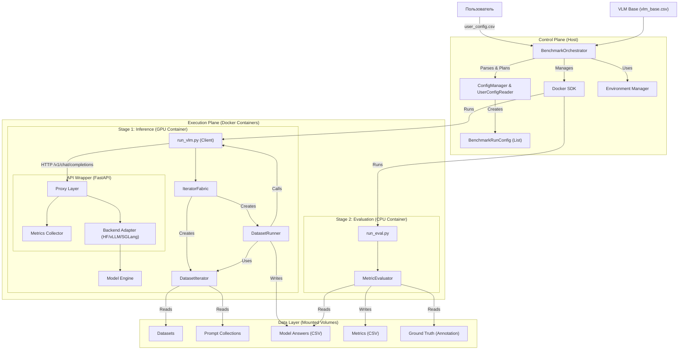

# Детальная спецификация архитектуры

Этот документ содержит детальное описание архитектуры VLMHyperBench, включая описание модулей, классов, методов и схему их взаимодействия.

## 1. Общая схема взаимодействия (Component Diagram)

Система разделена на **Control Plane** (управление) и **Execution Plane** (исполнение). Инференс абстрагирован через **API Wrapper** (FastAPI Proxy), унифицирующий взаимодействие с различными бэкендами (vLLM, HuggingFace, SGLang).

## 2. Подсистема управления окружением и воркерами

### 2.1. Worker Manager
Отвечает за распределение задач по доступным ресурсам.
*   **Функции**:
    *   Обнаружение доступных GPU (локально или в кластере).
    *   Создание пула воркеров (Worker Pool).
    *   Назначение задач (Evaluation Runs) свободным воркерам.
    *   Мониторинг состояния воркеров.

### 2.2. EnvManager
Абстрагирует жизненный цикл изолированной среды.

**Интерфейс `EnvManager`**:
*   `setup(requirements: List[str])`: Подготовка окружения (установка пакетов).
*   `run(command: str, volumes: Dict)`: Запуск команды с монтированием данных.
*   `cleanup()`: Освобождение ресурсов.
*   `mount_data(data_paths: Dict)`: Монтирование общих данных (Shared Storage).

**Реализации**:
*   `DockerEnvManager`: Использует Docker API. Для доступа к данным использует `volumes` (bind mounts).
*   `SingularityEnvManager`: Конвертирует Docker image в SIF и запускает.
*   `RunPodEnvManager`: Арендует Pod, синхронизирует данные (rsync/S3), запускает задачу.
*   `LocalVenvManager`: Создает временный venv (для отладки).

## 3. Подсистема Инференса (Model Interface)

Унифицирует работу с разными бэкендами (vLLM, SGLang, HF) через унифицированный **FastAPI Proxy**.

### 3.1. API Wrapper (FastAPI)
*   **Роль**: Унификация интерфейсов разных движков (HF, vLLM) к единому стандарту OpenAI API (`/v1/chat/completions`) и автоматический сбор метрик производительности.
*   **Компоненты**:
    *   **Proxy Layer**: Принимает HTTP запросы.
    *   **Backend Adapter**: Адаптирует запрос под конкретный движок (HuggingFace Adapter, vLLM Adapter).
    *   **Metrics Collector**: Замеряет TTFT, TPOT, Latency, Peak Memory.

### 3.2. Интерфейс `VLMInterface`
*   `load_model(config)`: Загрузка весов.
*   `generate(prompts, images, generation_config)`: Генерация ответов.

### 3.3. Адаптеры
*   `HuggingFaceAdapter`: `AutoModelForVision2Seq`.
*   `vLLMAdapter`: `vllm.LLM` с поддержкой batching.
*   `SGLangAdapter`: Клиент к SGLang server.

## 4. Подсистема Задач и Метрик

### 4.1. Task Registry
*   Определяет формат `DatasetIterator` (как читать данные).
*   Определяет `PromptStrategy` (как формировать промпт).

### 4.2. Metric Registry
*   Содержит реализацию метрик (ANLS, Accuracy, BLEU).
*   Позволяет динамически подгружать код метрик (например, из git-repo).

## 5. Подсистема Агрегации и Отчетов

### 5.1. MetricAggregator
*   **Вход**: `metrics.csv` (по каждому примеру).
*   **Конфиг**: Группировка по колонкам (например, `doc_type`, `field_name`).
*   **Выход**: Сводные таблицы.

### 5.2. ReportGenerator
*   Рендеринг Markdown/HTML отчетов с графиками (matplotlib/seaborn).

## 6. Технологический стек
*   **Core**: Python 3.10+, Pydantic (валидация конфигов).
*   **Containerization**: Docker SDK, Singularity (via subprocess).
*   **Cloud**: RunPod API / SkyPilot (опционально).
*   **Data**: Pandas, Polars (для быстрой обработки CSV).
*   **Tracking**: Arize Phoenix (промпты), MLflow/WandB (метрики - опционально).
*   **Inference**: vLLM, Transformers, SGLang.