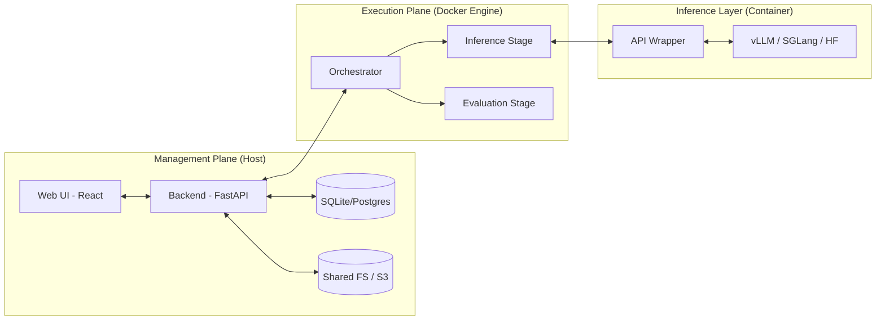
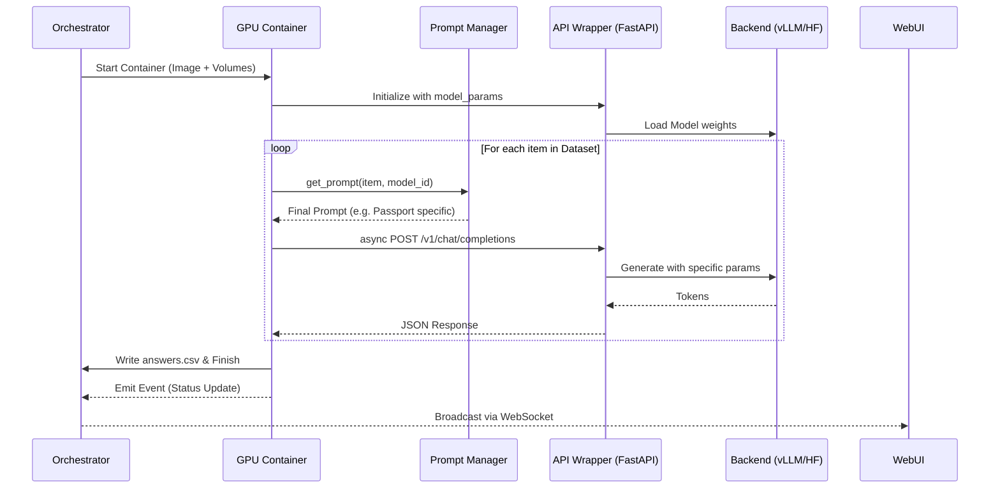
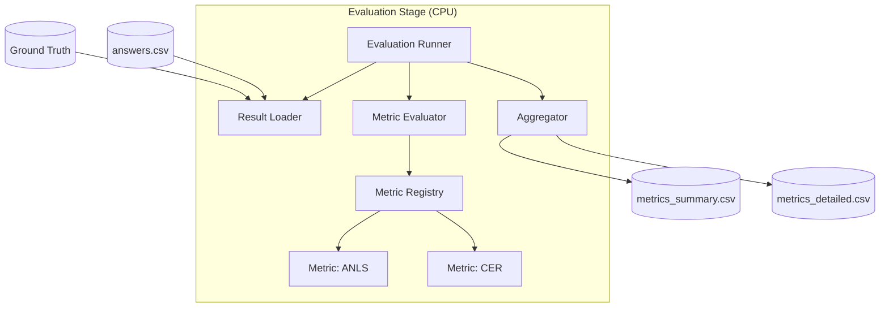

# Детальная спецификация архитектуры VLMHyperBench v0.2.0

Этот документ содержит детальное описание архитектуры платформы VLMHyperBench версии 0.2.0, включая описание модулей, классов, методов и схему их взаимодействия.

## 1. Общая схема платформы

Платформа разделена на три функциональные плоскости: **Management**, **Execution** и **Inference**.

### 1.2. Взаимодействие компонентов (Sequence Diagram)

## 2. Подсистема управления (Management Plane)

### 2.1. Backend (FastAPI)
*   **Role**: Центральный узел управления состоянием и данными.
*   **Key Methods**:
    *   `POST /experiments`: Создание нового бенчмарка.
    *   `GET /experiments/{id}/status`: Получение текущего состояния через WebSockets.
    *   `GET /analytics/{id}`: Подготовка данных для Plotly графиков.

### 2.2. Web UI (React)
*   **Role**: Визуализация и мониторинг.
*   **Features**: Real-time логи, интерактивные графики метрик, сравнение моделей.

## 3. Подсистема исполнения (Execution Plane)

### 3.1. Orchestrator (State Driven)
*   **BenchmarkPlanner**: Строит граф задач на основе конфига.
*   **TaskTracker**: Мониторит статусы (`PENDING`, `RUNNING`, `COMPLETED`, `FAILED`) каждого этапа.
*   **EventBus**: Транслирует события выполнения в Backend.

### 3.2. Inference Stage (run_vlm.py)
*   **AsyncDatasetRunner**: Асинхронно обрабатывает датасет, вызывая API Wrapper. Поддерживает инкрементальные запуски (перезапуск только неудачных задач).
*   **PromptManager**: Динамически выбирает системные и пользовательские промпты на основе типа документа (`item.metadata.doc_type`) и конфигурации модели. См. [ADR-009](./adr/009-prompt-management.md).

## 4. Слой инференса (Inference Layer)

### 4.1. API Wrapper (FastAPI Proxy)
*   Унифицирует доступ к моделям через OpenAI-совместимый протокол.
*   Поддерживает `model_params` для передачи специфичных настроек (например, `ngram_size`, `window_size` для DeepSeek-OCR).
*   Реализует `constrained decoding` через параметры `response_format`.
*   **Telemetry**: Собирает метрики производительности (TTFT, TPOT) и ресурсов (Peak VRAM) для каждого запроса.
*   **Watchdog**: Фоновый процесс для живого мониторинга ресурсов системы. См. [ADR-010](./adr/010-resource-monitoring.md).

### 4.2. Backend Adapters
*   `vLLMAdapter`: Интеграция с `guided_decoding`.
*   `SGLangAdapter`: Использование FSM для структурированного вывода.
*   `HuggingFaceAdapter`: Использование библиотеки **Outlines** для наложения масок на логиты.

## 5. Слой оценки (Evaluation Layer)

### 5.1. DataParser & Validation
*   Извлекает структурированные данные из ответов.
*   **Pydantic Validation**: Проверяет соответствие JSON заданной схеме.
*   **Metric: Structural Fidelity**: Фиксирует валидность формата.

### 5.2. Metric Registry & Aggregator
*   **Hierarchy**: `TextMetric` (CER/ANLS), `FieldMetric` (JSON match), `ClassificationMetric`, `ResourceMetric` (VRAM/Latency).
*   **Metric Registry**: Поддерживает версионирование алгоритмов расчета (например, `ANLS_v1`, `ANLS_v2`).
*   **Aggregation Strategies**: `by_id` (детально), `by_category` (группировка), `general` (общий итог).

### 5.3. Evaluation Flow (Independent Stage)

## 6. Технологический стек
*   **Frontend**: React, Tailwind CSS, Plotly.js.
*   **Backend**: FastAPI, Pydantic, SQLAlchemy.
*   **Execution**: Docker SDK, vLLM, SGLang, Outlines.
*   **Data**: Pandas, Polars.